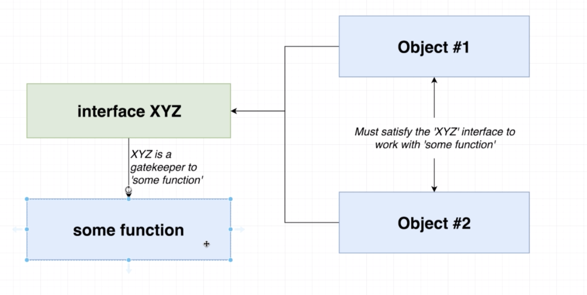

# Interfaces

Interfaces create a new type (just like string or number)

You use them when you're creating objects. 

## Interfaces define the _minimum_ 
It isn't "specifically this" it is "atleast this" 

You can have the object have a bunch more shit in it than defined in the interface ie: 

```ts
type Vehicle = {
  summary(): string
}

const newCivic: Vehicle = {
  // Notice it has more properties than the interface
  name: 'McLaren',
  year: 2019,
  broken: false,
  summary(): string {
    return `Name: ${this.name}, Year: ${this.year}`
  }
}

// typescript will only check that newCivic has a summary function, not that it has other shit. 
const tsPrintVehicle = (vehicle: Vehicle): void => {
  console.log(vehicle.summary)
}

tsPrintVehicle(newCivic)
```

at this stage you would then refactor this interface to not be specifically "Vehicle" but something like "canBeSummarised" or "Summarisable" - this is so you can reuse this interface on other unrelated objects.  (as long as that new object has a "summary" function)  

## General Plan With Interfaces 
!! 
The General strategy for reusable code in TS is: 

1. Create functions that accept arguments that are typed with interfaces 
2. Then to call that function, Objects/classes can decide to 'implement' a given interface to work with a function

Not every last function needs an interface, but on most cases, use an interface. 

You use interfaces to _govern_ access to some function. ie: 



