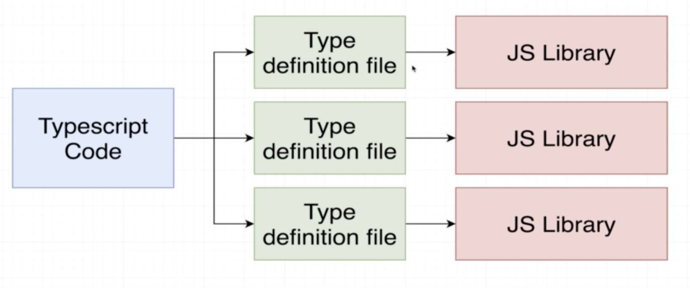
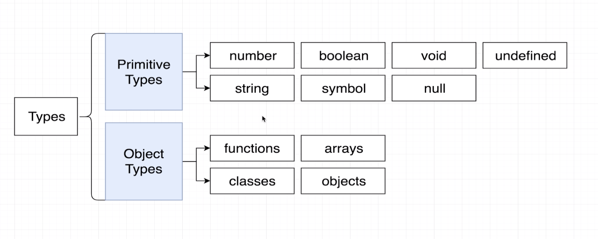

# Typescript

The typescript system:

- helps us catch errors _during_ development (in javascript, the only way to find bugs is to run the code.)
- uses type annotations
- the type system is only active during development. It compiles into javascript
- TS compiler does no performance optimisation at all.

Everything runs through the TS compiler, spits out JS. We then run it.

## Typescript Playground

[Go here](http://www.typescriptlang.org/play/index.html) to have a go with a TS playground

## Objective

Basically all we do is just add syntax to our code. It eventually ends up as javascript.

Think of typescript as a dude sitting behind you watching you to watch you and stop you from making errors.

## Setup

`npm install -g typescript ts-node`

once this is done you can use `tsc` which stands for "type script compiler"

To run stuff in the browser you can use `parcel-bundler`

## ts-node

to run a file you need to compile it first.

```bash
tsc index.ts
node index.js
```

but you can join these with ts-node.

`ts-node index.ts`

## Parcel Bundler

takes an index.html with a script source with a index.ts

## Import works

!! Import works here on node, rather than pre node 12

You can use standard libraries, however you'll see an error in ts saying it has type 'any'
To fix this, it has the concept of a "type definition file"



Sometimes packages include a type definition file for us. `Axios` has a type definition file, things like `faker`. You can tell if there is a definition file by trying to importing it. If you get the error message then it doesn't come with it.

To install them. Use the `@types` module which is called "Definitely Typed"

`@types/faker`

## Type definition files

These are build by random developers and usually install a `index.d.ts` which will be a bunch of definitions.

The nice thing about this is that it gives you a cmd+click option to go see what the functionality is. This can be used as a type of documentation.

## Catching errors

The first example is if you write out code like this:

```js
const ID = todo.ID
const title = todo.title
const finished = todo.finished
```

when the json data is actually:

```js
{
  userId: 1,
  id: 1,
  title: 'delectus aut autem',
  completed: false
}
```

these simple typos are what is fixed by TS

## Interfaces

these say "There will be some type of data type in the program that will contain the following data.

```js
interface Todo {
  id: number
  title: string
  completed: boolean
}
```

then you call it with

```js
const todo = response.data as Todo
```

if you do that, then the code in the [[Catching erros]] section will throw 3 errors.

The nice thing is, if you try and reference some part of an object that isn't there, typescript will tell you.

## Variable assignment and type annotations

You can assign a type to these by doing:

```ts
const logTodo = (id: number, title: string, completed: boolean) => {
```

which means, if you mix up the variables, it will tell you.

```ts
interface Todo {
  id: number
  title: string
  completed: boolean
}

axios.get(url).then(response => {
  const todo = response.data as Todo

  const id = todo.id
  const title = todo.title
  const completed = todo.completed

  logTodo(id, completed, title) // this will fail because completed isn't a string
})

const logTodo = (id: number, title: string, completed: boolean) => {
  console.log(`
  The Todo with ID: ${id}
  has a title of: ${title},
  is it finished? ${completed}`)
}
```

This will throw an error because you mixed up the variables.

## Features

Type definition:

> Easy way to refer to the different properties + functions that a value has.
> They are just shortcuts to say "That value has all these properties and methods" (ie string has .concat() and such)

Where do we use them? Everywhere.

### Types

Remember a type is a shortcut to say "Here are the values and functions that this variable has"

`number` includes both int and float.
new `Date()` gives an object `Date`

There are two different types. Primative and Object.



Why do we care about types?

1. If you try and reference something later on, typescript will warn you
2. it helps other developers see what kinda of data is flying around.

### Typescript in vscode

If you hover over a variable (ie date in this)

```ts
const date = new Date()
```

if you hover over the variable, you will get something like:

```ts
const today: Date
```

This is telling you that the variable is of type `Date`

Vs code lets you see a list of what's available.

### Type annotations vs Inference

Annotations are when we're telling TS what the type is, Inference is when TS tries to figure it out itself.

You can write all of these without annotations. This is inference.

```ts
let apples: number = 5

let speed: string = 'fast'
let hasName: boolean = true

// its interesting here because type is the same as the value
let nothingMuch: null = null
let nothing: undefined = undefined
```

if you remomved all the annotations, ts would still be fine with it.

### annotations for functions

they are nasty as fuck

```ts
// Function
const logNumber: (i: number) => void = (i: number) => {
  console.log(i)
}
```

thats nasty - where is the bloody type annotation finishing? and the function starting?
`(i: number) => void` is the annotation

### Type inference


If decleration and initialisation _on the same line_, TS firgures it out for you.

### When to use inference?

Always. When possible. However there are 3 scenarios where you would use annotations

1. When we declare a function on one line and initialise it later.
2. we want a variable to have a type that can't be inferred
3. when the function returns any and we need to clarify the value

#### Any Type

Avoid using any at all costs. The entire idea of typescript is to catch errors. It can't do that if you use an any type.

### Type inference for functions.

- Will only try figure out the return.
- you will always have to annotate the inputs.
- type inference works on the return - but don't ever use it.

you always define the return type because if you make a mistake (like leave off a return statement) TS will not pick it up

## Objects annotations.
