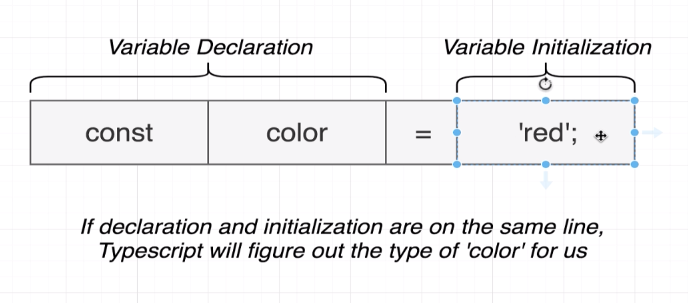

# Typescript

The typescript system:

- helps us catch errors _during_ development (in javascript, the only way to find bugs is to run the code.)
- uses type annotations
- the type system is only active during development. It compiles into javascript
- TS compiler does no performance optimisation at all.

Everything runs through the TS compiler, spits out JS. We then run it.

Some cool things include:

- Interfaces, which allow you to give objects access to methods if they have a particular 'shape' 
- The big one is, you really only need to write code once. Say for example the Sort project `examples/sort` It has a bubble sort implementation. You can write this once, then all you have to do is remember the compare and swap methods for any other project. Compare and Swap items is relatively easy compared to remembering a sorting algorithm. 

## Getting Started

I like using concurrently and yarn for running 

```sh
yarn init
```

```sh
tsc --init
```

then in package.json, have this: 

```json
{
  "dependencies": {
    "concurrently": "^4.1.1",
    "nodemon": "^1.19.1"
  },
  "scripts": {
    "start:build": "tsc -w",
    "start:run": "nodemon build/index.js",
    "start": "concurrently yarn:start:*"
  }
}
```


## Typescript Playground

[Go here](http://www.typescriptlang.org/play/index.html) to have a go with a TS playground

## Objective

Basically all we do is just add syntax to our code. It eventually ends up as javascript.

Think of typescript as a dude sitting behind you watching you to watch you and stop you from making errors.

## Setup

`npm install -g typescript ts-node`

once this is done you can use `tsc` which stands for "type script compiler"

To run stuff in the browser you can use `parcel-bundler`

## ts-node

to run a file you need to compile it first.

```bash
tsc index.ts
node index.js
```

but you can join these with ts-node.

`ts-node index.ts`

## Parcel Bundler

takes an index.html with a script source with a index.ts

## Import works

!! Import works here on node, rather than pre node 12

convention is to never use `export default` by the way. It just gets confusing when to use {} or not.

You can use standard libraries, however you'll see an error in ts saying it has type 'any'
To fix this, it has the concept of a "type definition file"


Sometimes packages include a type definition file for us. `Axios` has a type definition file, things like `faker`. You can tell if there is a definition file by trying to importing it. If you get the error message then it doesn't come with it.

To install them. Use the `@types` module which is called "Definitely Typed"

`@types/faker`

## Type definition files

!! Get in the habit of reading these.

These are build by random developers (usually [definitely typed](https://github.com/DefinitelyTyped/DefinitelyTyped)) and usually install a `index.d.ts` which will be a bunch of definitions.

The nice thing about this is that it gives you a cmd+click option to go see what the functionality is. This can be used as a type of documentation.

Sometimes the type definition files are actually _more_ updated than the documentation.

### Using 3rd party types in ts whne not imported

You can just install the type definitions (say for google which is added via a `<script>` and it will work in the editor.)

## Catching errors

The first example is if you write out code like this:

```js
const ID = todo.ID
const title = todo.title
const finished = todo.finished
```

when the json data is actually:

```js
{
  userId: 1,
  id: 1,
  title: 'delectus aut autem',
  completed: false
}
```

these simple typos are what is fixed by TS

## Interfaces

these say "There will be some type of data type in the program that will contain the following data.

```js
interface Todo {
  id: number
  title: string
  completed: boolean
}
```

then you call it with

```js
const todo = response.data as Todo
```


if you do that, then the code in the [[Catching erros]] section will throw 3 errors.

The nice thing is, if you try and reference some part of an object that isn't there, typescript will tell you.

### Interfaces - Why: 
It's like a contract that says "If your data has these properties, then you can have access to these methods.

### Interfaces vs Type Alias

You should always use Interfaces where possible. Type Aliases are used when you join two interfaces or something.

There is an argument to be made that you should use type aliases for react state. Might be worth looking into some examples tho.

## class Whatever _implements_ interfaceName

You use this to get typescript to tell you what is broken in the class. Usually you would only see what is broken at instantiation, which could be in a completely different file.

Export the interface, and import it in the class file. Then use the `implements interfaceName` in the class

```ts
export class User implements Mappable {}
```

## Variable assignment and type annotations

You can assign a type to these by doing:

```ts
const logTodo = (id: number, title: string, completed: boolean) => {
```

which means, if you mix up the variables, it will tell you.

```ts
interface Todo {
  id: number
  title: string
  completed: boolean
}

axios.get(url).then(response => {
  const todo = response.data as Todo

  const id = todo.id
  const title = todo.title
  const completed = todo.completed

  logTodo(id, completed, title) // this will fail because completed isn't a string
})

const logTodo = (id: number, title: string, completed: boolean) => {
  console.log(`
  The Todo with ID: ${id}
  has a title of: ${title},
  is it finished? ${completed}`)
}
```

This will throw an error because you mixed up the variables.

## Features

Type definition:

> Easy way to refer to the different properties + functions that a value has.
> They are just shortcuts to say "That value has all these properties and methods" (ie string has .concat() and such)

Where do we use them? Everywhere.

### Types

Remember a type is a shortcut to say "Here are the values and functions that this variable has"

`number` includes both int and float.
new `Date()` gives an object `Date`

There are two different types. Primative and Object.


Why do we care about types?

1. If you try and reference something later on, typescript will warn you
2. it helps other developers see what kinda of data is flying around.

### Typescript in vscode

If you hover over a variable (ie date in this)

```ts
const date = new Date()
```

if you hover over the variable, you will get something like:

```ts
const today: Date
```

This is telling you that the variable is of type `Date`

Vs code lets you see a list of what's available.

### Type annotations vs Inference

Annotations are when we're telling TS what the type is, Inference is when TS tries to figure it out itself.

You can write all of these without annotations. This is inference.

```ts
let apples: number = 5

let speed: string = 'fast'
let hasName: boolean = true

// its interesting here because type is the same as the value
let nothingMuch: null = null
let nothing: undefined = undefined
```

if you remomved all the annotations, ts would still be fine with it.

### annotations for functions

they are nasty as fuck

```ts
// Function
const logNumber: (i: number) => void = (i: number) => {
  console.log(i)
}
```

thats nasty - where is the bloody type annotation finishing? and the function starting?
`(i: number) => void` is the annotation

### Type inference


If decleration and initialisation _on the same line_, TS firgures it out for you.

### When to use inference?

Always. When possible. However there are 3 scenarios where you would use annotations

1. When we declare a function on one line and initialise it later.
2. we want a variable to have a type that can't be inferred
3. when the function returns any and we need to clarify the value

#### Any Type

Avoid using any at all costs. The entire idea of typescript is to catch errors. It can't do that if you use an any type.

### Type inference for functions.

- Will only try figure out the return.
- you will always have to annotate the inputs.
- type inference works on the return - but don't ever use it.

you always define the return type because if you make a mistake (like leave off a return statement) TS will not pick it up

## Working with tsc

```bash
tsc index.ts
```

Just creates a index.js file

The best way to do this is to have a `src` and a `build` folder.

You do this with the ts config file:

```bash
tsc --init
```

Then you can change the settings in `tsconfig.json` for `outDir` and `rootDir`

Then you could just run `tsc -w` and it will do everything for you (and watch it with the `-w` flag)

## Type Guards

These are like an if statement for type = string
they look like this:

```ts
if (this.whatever instanceof Array) {
  // this works for everything else. even classes you make
}

if (typeof this.whatever === 'string') {
  // this works for primatives (strings, numbers or bool )
}
```


## Abstract Classes 
Used for parent classes that will need access to a child's methods. 

- They can never be instantiated with `const x = new X` 
- they can only ever be used as a parent class
- Can obtain real implementations (See SuperSort in examples/sort)
- implemented methods can refer to other methods that don't exist yet. You just have to write them out in the abstract class body. 
- Can make child classes promise that they'll all have a pareticular set of methods or data structure. 


they look like this: 

```ts
// Note the abstract keywords
export abstract class Sorter {

  // abstract properties
  abstract length: number

  // abstract methods
  abstract compare(i: number):bool 

  someMethod(): void {
    console.log("whatever)
  }
}
```

### Abstracts vs Interfaces

Interfaces: 

- Sets up a contract between different classes
- Use when we have very different objects that we want to work together 
- They are "loosley coupled

Abstract Classes: 

- Sets up a contract between different classes 
- Use when we are trying to build up a definition of an object
- strongly coupled classes

When the classes are pretty "closely related" use Abstract Classes. You will know because you'll want to use some methods of a parent class on a child class. 
ie. child methods cant function without the parent method and vice versa. 

#### When to use each?

Always reach for interfaces first. Unless you have different objects that are closely related. 